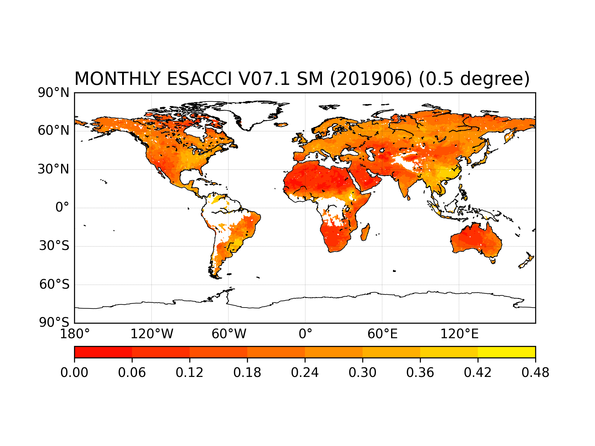

# 1. Background

> [ESA Soil Moisture Climate Change Initiative (Soil_Moisture_cci): COMBINED product, Version 07.1](https://catalogue.ceda.ac.uk/uuid/c7e974411cfe4cf99cb077f7cb4d75d4) is a long-term global SM product by merging active and passive products (Nov. 1978 to 2021), provided as global daily images in NetCDF-4 classic file format, presents a global coverage of surface soil moisture at a spatial resolution of 0.25 degrees.

- [Download website](https://data.ceda.ac.uk/neodc/esacci/soil_moisture/data/daily_files/COMBINED/v07.1/1980)

- I downloaded daily nc files covering 19800101-20191231 via [FTP](https://help.ceda.ac.uk/article/280-ftp), saved in **'../DATA_org'** with yearly sub-directories.

- The time range I chose here is **1980.01.01-2019.12.31**
- Each file is named as "ESACCI-SOILMOISTURE-L3S-SSMV-COMBINED-YYYYMMDD000000-fv07.1.nc"
- As only daily nc files with 0.25 $\degree$ are provided, but I need monthly nc files with 0.5$\degree$ spatial resolution, so the original daily files need to be resampled and interpolated.

# 2. Environment

- Linux (#44~22.04.1-Ubuntu SMP PREEMPT_DYNAMIC Mon May 22 13:39:36 UTC 2 x86_64 x86_64 x86_64 GNU/Linux)
- Anaconda (23.1.0)
- Python (3.10)
- main packages: netCDF4 (1.6.4), xarray (2023.3.0)

# 3. introduction

1. [average_monthly_nc_esacci.py](https://github.com/70iscoolest/aggregate-0.25-degree-daily-ESA-CCI-soil-moisture-into-0.5-degree-monthly-nc-files/blob/master/average_monthly_nc_esacci.py) aims to average daily values into monthly values
2. [resample_nc_esacci.py](https://github.com/70iscoolest/aggregate-0.25-degree-daily-ESA-CCI-soil-moisture-into-0.5-degree-monthly-nc-files/blob/master/resample_nc_esacci.py) aims to interpolate monthly files with 0.25$\degree$ to monthly files with 0.5$\degree$, and a nc file combining all monthly files along "time" array is also generated.

# 4. Visulazation

- plot aggregated and interpolated nc file

# 4. Citation
The data set should be cited using the following references:

1. Gruber, A., Scanlon, T., van der Schalie, R., Wagner, W., and Dorigo, W. (2019). Evolution of the ESA CCI Soil Moisture climate data records and their underlying merging methodology, Earth Syst. Sci. Data, 11, 717–739, https://doi.org/10.5194/essd-11-717-2019

2. Dorigo, W.A., Wagner, W., Albergel, C., Albrecht, F., Balsamo, G., Brocca, L., Chung, D., Ertl, M., Forkel, M., Gruber, A., Haas, E., Hamer, D. P. Hirschi, M., Ikonen, J., De Jeu, R. Kidd, R. Lahoz, W., Liu, Y.Y., Miralles, D., Lecomte, P. (2017). ESA CCI Soil Moisture for improved Earth system understanding: State-of-the art and future directions. In Remote Sensing of Environment, 2017, ISSN 0034-4257, https://doi.org/10.1016/j.rse.2017.07.001